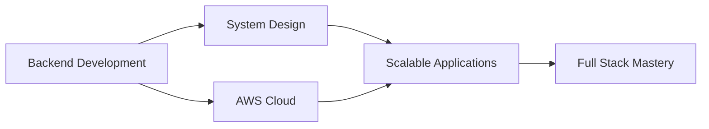

<div align="center">

# 👋 Hey there, I'm Adesh Tayade


[](https://www.linkedin.com/in/adesh-tayade-80a138291)
[](https://github.com/Adesh)
[](mailto:atayade241@gmail.com)

</div>

---

## 🚀 About Me

```javascript
const adesh = {
    location: "Pune, Maharashtra, India 🇮🇳",
    education: "Final Year - Computer Engineering",
    currentFocus: ["Backend Development", "Cloud Computing", "System Design"],
    interests: ["Web Development", "AWS Services", "Cricket 🏏"],
    lifePhilosophy: "Keep learning. Keep building. Keep growing.",
    funFact: "I debug code faster when cricket is on! 🏏💻"
};
```


### 💡 What I'm Up To

- 🔨 Building full-stack web applications
- ☁️ Diving deep into AWS cloud services
- 📚 Mastering backend development & system architecture
- 🌱 Contributing to open source projects
- 🎯 Solving DSA problems daily

---

## 🛠️ Tech Arsenal

### Languages


### Web Development


### Cloud & Tools


---

## 📊 GitHub Analytics

<div align="center">
  


</div>

---

## 🎯 Current Learning Journey



<div align="center">

### 📈 Contribution Graph
[](https://github.com/adesh-tayade)

</div>

---

## 🏆 Achievements & Goals

<div align="center">

| 🎓 Education | 🚀 Projects | ☁️ Cloud | 🏏 Passion |
|:---:|:---:|:---:|:---:|
| Computer Engineering | Full Stack Apps | AWS Explorer | Cricket Enthusiast |
| Final Year | Open Source | Cloud Architecture | Player & Fan |

</div>

---

## 💼 Professional Interests

<table>
<tr>
<td width="50%">

### 🔧 Technical Skills
- Backend Development
- Cloud Computing (AWS)
- Web Development
- Database Management
- Version Control (Git)
- Problem Solving & DSA

</td>
<td width="50%">

### 🌱 Currently Exploring
- Microservices Architecture
- Docker & Kubernetes
- AWS Services (EC2, S3, Lambda)
- RESTful API Design
- System Design Patterns
- DevOps Practices

</td>
</tr>
</table>

---

## 🌐 Let's Connect!

<div align="center">

💼 **Looking for opportunities in:** Backend Development | Full Stack Development | Cloud Computing

📧 **Get in touch:** [atayade241@gmail.com](mailto:atayade241@gmail.com)

🔗 **Connect on LinkedIn:** [Adesh Tayade](https://www.linkedin.com/in/adesh-tayade-80a138291)


</div>

---

<div align="center">

### 💭 Quote of the Day


### ⚡ Fun Fact
*"The best code is written between cricket matches! 🏏"*

---

**Thanks for stopping by!** 😊  
*Feel free to explore my repositories and let's build something amazing together!* 🚀


</div>
